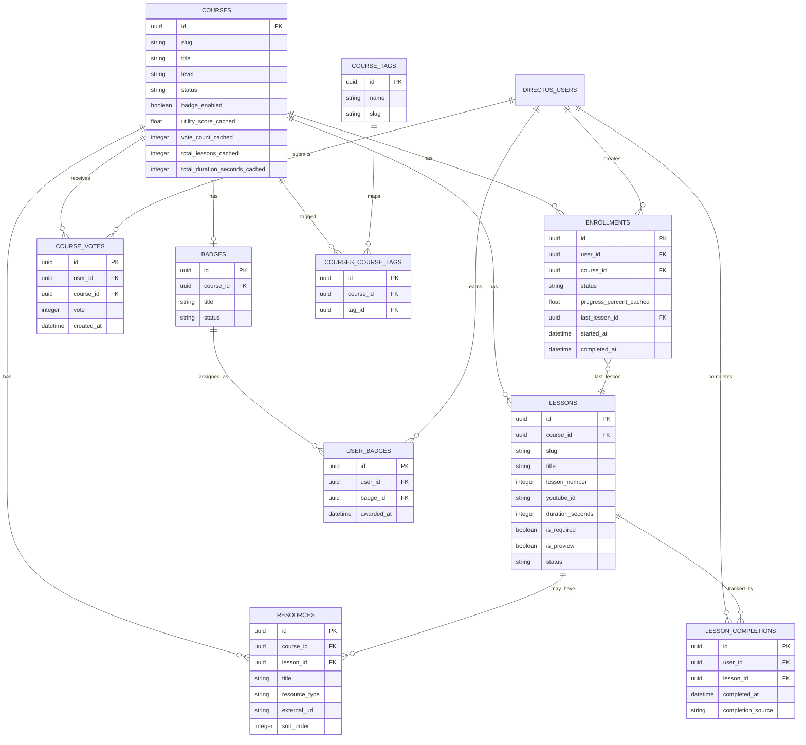

# DATA DREAMER COURSES — PRODUCT REQUIREMENTS DOCUMENT

> Version: 1.0
> Last updated: 2026-04-02
> Stack: Astro v5 (SSR) + Directus + Coolify + Cloudflare
> Author: Atef Alvi
> Status: Pre-development — approved for Phase 1 scoping

---

## TABLE OF CONTENTS

1. [Purpose & Vision](#1-purpose--vision)
2. [Product Principles](#2-product-principles)
3. [Users & Use Cases](#3-users--use-cases)
4. [Design Language & Visual Spec](#4-design-language--visual-spec)
5. [Information Architecture](#5-information-architecture)
6. [Core User Journeys](#6-core-user-journeys)
7. [Functional Requirements](#7-functional-requirements)
8. [Wireframes](#8-wireframes)
9. [Data Model](#9-data-model)
10. [API Endpoints](#10-api-endpoints-astro-server-routes)
11. [Authentication Architecture](#11-authentication-architecture)
12. [Security & Privacy Model](#12-security--privacy-model)
13. [SEO & Structured Data](#13-seo--structured-data)
14. [Email Flows](#14-email-flows)
15. [Error & Loading States](#15-error--loading-states)
16. [Directus Schema & Access Policies](#16-directus-schema--access-policies)
17. [Navigation & Site Integration](#17-navigation--site-integration)
18. [Feature Priority & Impact Matrix](#18-feature-priority--impact-matrix)
19. [Phase Execution Plan](#19-phase-execution-plan)
20. [Open Questions & Decisions](#20-open-questions--decisions)

---

## 1. Purpose & Vision

Add a **Courses** section to `data-dreamer.net` — a structured learning library built from curated YouTube videos, PDFs, mind maps, and reference links.

This is **not an LMS**. It is a lean, privacy-first, self-hosted course catalogue with student accounts and progress tracking.

### Product goals

1. Help visitors learn through structured, practical data/AI/analytics content.
2. Allow publishing new courses in Directus with no code changes.
3. Track progress with minimal user data — nothing collected that isn't needed.
4. Integrate cleanly into the existing site's brutalist design language.
5. Establish a stable foundation for future phases without over-engineering v1.

### Non-goals (v1)

- No quizzes or assignments
- No comments or discussion
- No cohort or group management
- No certificates with legal or verifiable claims
- No paid courses or payment processing
- No complex social features
- No custom analytics dashboard (aggregate counts only via Directus admin)
- No mobile app

---

## 2. Product Principles

### 2.1 Lean and maintainable
The system should do one thing well: publish course pages, let learners sign up, save progress, and access resources. If a feature makes authoring, maintenance, or privacy meaningfully worse, it does not belong in v1.

### 2.2 Privacy-first
Only collect what is functionally required:
- Account creation (display name, email, password hash)
- Login session
- Enrollment state
- Lesson completion state
- Optional single utility vote per course

**Never collect:** watch-time telemetry, device fingerprinting, IP-linked analytics, advertising identifiers, mouse tracking, or any behavioral data beyond completion state.

### 2.3 Design coherence
Every page in the Courses section should feel native to the existing site — same design tokens, same typography, same brutalist aesthetic. No new UI frameworks.

### 2.4 Security by default
- Progress writes are server-side and session-derived — no client can submit arbitrary `user_id`
- All auth endpoints are rate-limited
- Sessions use `HttpOnly`, `Secure`, `SameSite=Lax` cookies
- Completion endpoints are idempotent (duplicate submissions are safe)
- Input is validated and sanitised server-side before any Directus write

### 2.5 Creator simplicity
A course should be publishable in under 10 minutes:
1. Create course in Directus
2. Add lessons (paste YouTube IDs)
3. Attach resources (upload PDF or paste URL)
4. Toggle status to `published`

---

## 3. Users & Use Cases

### 3.1 Explorer (logged-out)
Wants to browse and evaluate whether a course is worth taking.

**Needs:**
- Course overview, description, lesson list, tags, level
- Estimated duration and lesson count
- Sample resources (free to see, gated to download in v1)
- Clear, honest "sign up to track progress" CTA — not a wall

**Behaviour:** can browse `/courses` and `/courses/[slug]` freely. Lesson pages show content preview; completion tracking and resource downloads require login.

---

### 3.2 Active Student (logged-in, enrolled)
Has an account and wants to continue learning without friction.

**Needs:**
- Resume exactly where they left off
- Clear progress state at course and lesson level
- Downloadable resources in one place
- Badge on completion

---

### 3.3 Returning Learner
Comes back after days or weeks away.

**Needs:**
- Quick "continue learning" path without hunting
- Stable login, no forced re-auth for non-sensitive actions
- Clear "last lesson visited" entry point

---

### 3.4 Creator/Admin
Publishes and maintains content via Directus.

**Needs:**
- Simple form-based authoring — no custom CMS
- Lesson reordering
- YouTube ID swap without breaking progress state
- PDF upload and external link management
- Enrollment count and completion count visible in Directus

---

## 4. Design Language & Visual Spec

All Courses pages must use the existing design system. No new fonts, no new colour palettes.

### 4.1 Tokens to use

| Token | Value | Use |
|---|---|---|
| `--accent` | `#FF2E00` | CTAs, active states, progress bars, badges |
| `--bg-primary` | `#050505` dark / `#F2F2F7` light | Page background |
| `--bg-surface` | `#0A0A0A` dark / `#FFFFFF` light | Cards, panels |
| `--bg-muted` | `#141414` dark / `#E5E5EA` light | Subtle backgrounds |
| `--text-primary` | `#FFFFFF` dark / `#1C1C1E` light | Body text |
| `--text-secondary` | `#A0A0A5` dark / `#636366` light | Meta text, labels |
| `--border` | `#242426` dark / `#D1D1D6` light | Dividers, card borders |
| `--font-display` | Anton | H1, H2, card titles, labels |
| `--font-tech` | JetBrains Mono | Meta, tags, stats, navigation |

### 4.2 Typography hierarchy

| Element | Font | Size | Transform |
|---|---|---|---|
| Page title (H1) | Anton | `clamp(48px, 8vw, 96px)` | UPPERCASE |
| Course card title | Anton | `clamp(20px, 3vw, 28px)` | UPPERCASE |
| Lesson title | Anton | `clamp(28px, 5vw, 48px)` | UPPERCASE |
| Section label | JetBrains Mono | `10px` | UPPERCASE + letter-spacing |
| Body / description | JetBrains Mono | `14–16px` | Sentence case |
| Tags / meta | JetBrains Mono | `10–11px` | UPPERCASE |
| Progress stats | Anton | `24–32px` | Numeric |

### 4.3 Component conventions

**Course card:** black surface, 1px `--border` border, accent top-bar on hover (same pattern as skill cards in `AboutStack`), no border-radius (brutalist reset).

**Progress bar:** thin 4px bar, `--bg-muted` track, `--accent` fill. No rounded ends.

**Buttons:** use existing `.btn-primary` (red fill) and `.btn-secondary` (border, transparent) — no new button variants.

**Badge:** monochrome icon + course name in Anton. Accent border. No gradients or skeuomorphic design.

**Tags:** JetBrains Mono 10px, `1px solid var(--accent)`, accent text — matching existing `.project-tag` pattern.

**Status indicators:** green dot (pulsing) = active/available, grey = locked, red = required action.

### 4.4 Layout

- Use existing `.container` (max-width: 1200px, `--container-padding`)
- Hero sections follow same pattern: `// META_LABEL` above the Anton H1
- Section separators: `1px solid var(--border)` — no heavy dividers

---

## 5. Information Architecture

```text
/
├── /courses                              ← public listing
│   └── /courses/[courseSlug]            ← public course landing
│       └── /courses/[courseSlug]/[lessonSlug]  ← student lesson page
│
├── /signup                              ← public
├── /login                               ← public
├── /logout                              ← POST endpoint (no page)
├── /forgot-password                     ← public
├── /reset-password                      ← public (tokenised link)
│
└── /student                             ← protected (requires auth)
    └── /student/settings                ← account management
```

### Routing decisions

- Lesson pages live under the course slug to keep URLs readable and SEO-friendly: `/courses/airflow-fundamentals/intro-to-dags`
- `/student` is a flat dashboard — not nested per course (that lives on the public course page for enrolled users)
- Auth pages (`/signup`, `/login`) are public — the middleware only protects `/student/*`

---

## 6. Core User Journeys

### 6.1 Discovery → Enrolment

```
/courses
  └── User sees course card → clicks "View Course"
        └── /courses/[slug]
              ├── [logged out] → sees overview + lesson list + CTA "Sign up to track progress"
              │     └── clicks CTA → /signup?redirect=/courses/[slug]
              │           └── creates account → redirected back to /courses/[slug]
              │                 └── clicks "Start Course" → enrollment created → first lesson
              └── [logged in] → sees progress bar (if enrolled) or "Start Course" CTA
                    └── clicks "Start Course" → enrollment created → /courses/[slug]/[lesson1slug]
```

### 6.2 Lesson → Completion

```
/courses/[courseSlug]/[lessonSlug]
  ├── User watches video
  ├── [optional] YouTube "ended" event surfaces highlighted "Mark Complete" button
  ├── User clicks "Mark Complete"
  │     └── POST /api/courses/complete (server validates session, writes completion, updates enrollment)
  │           └── Progress updates visually
  │                 ├── If last lesson → badge awarded → completion modal
  │                 └── "Next Lesson →" CTA becomes prominent
  └── User clicks "Next Lesson →" → navigates to next lesson page
```

### 6.3 Return flow

```
/login
  └── User logs in → redirected to /student
        └── "Continue Learning" card shows last lesson in last active course
              └── User clicks "Resume" → /courses/[courseSlug]/[lessonSlug]
```

### 6.4 Completion & Badge

```
User completes final required lesson
  └── Server checks: all required lessons completed?
        └── Yes → mark enrollment.status = "completed", create user_badge record
              └── Frontend shows completion modal with badge
                    └── User sees badge on /student dashboard
```

---

## 7. Functional Requirements

### 7.1 Authentication

#### Mechanism
Directus native auth via email/password. Astro SSR middleware reads the session token from an `HttpOnly` cookie on every protected request. Token is validated server-side — no client-side JWT inspection.

#### Cookie configuration
```
Name:     directus_session_token
HttpOnly: true
Secure:   true (HTTPS only)
SameSite: Lax
Path:     /
MaxAge:   7 days (configurable)
```

#### Required pages
| Route | Purpose |
|---|---|
| `/signup` | New account creation |
| `/login` | Email + password login |
| `/logout` | POST — clears cookie, invalidates Directus session |
| `/forgot-password` | Request reset email |
| `/reset-password?token=` | Set new password via Directus token |

#### Signup fields (minimum required)
| Field | Type | Validation |
|---|---|---|
| `display_name` | string | Required, 2–50 chars, no HTML |
| `email` | string | Required, valid email format, unique |
| `password` | string | Required, min 8 chars |

#### Post-signup flow
1. Directus creates user with role `student`
2. Session cookie issued
3. User redirected to `redirect` query param (if safe) or `/student`
4. **No email verification in v1** (keep friction low; add in Phase 2 if spam becomes a concern)

#### Redirect safety rule
Only honour `?redirect=` values that start with `/` and do not contain `://`. Prevents open redirect attacks.

---

### 7.2 Astro Middleware (auth protection)

```typescript
// src/middleware.ts
// Protects all /student/* routes
// Adds user context to Astro.locals for any page that needs it
```

Middleware should:
1. Read `directus_session_token` cookie
2. Validate with Directus `GET /auth/me` (cached per-request)
3. If invalid on `/student/*` → redirect to `/login?redirect=[current path]`
4. If valid → populate `Astro.locals.user = { id, email, display_name }`
5. On public pages → populate user context silently (used to show/hide CTAs)

---

### 7.3 Course listing (`/courses`)

**Purpose:** browsable catalogue — discoverable by search engines, usable without an account.

**Content:**
- Page hero: `// LEARN` label + "COURSES" Anton heading + short descriptor
- Filter bar: Level (Beginner / Intermediate / Advanced) + Tag filter (scrollable chip row) — matching existing `.filter-btn` pattern
- Sort: Newest / Most Useful / Shortest
- Course cards grid (3-col desktop → 2-col tablet → 1-col mobile)

**Card fields:**
- Course title (Anton)
- Short description (1 line)
- Level tag
- Topic tags (up to 3)
- Lesson count + estimated duration
- Utility score (e.g. `4.8 / 5`) — shown only when ≥ 3 votes
- Badge available indicator
- CTA: "View Course →"

**Logged-in enhancement:** if enrolled, replace CTA with "Continue → Lesson N" and a mini progress bar.

**Empty state:** `// NO COURSES YET — CHECK BACK SOON.` in JetBrains Mono.

---

### 7.4 Course landing page (`/courses/[courseSlug]`)

**Sections (top to bottom):**

1. **Hero**
   - `// COURSE_[LEVEL]` label
   - Course title (large Anton)
   - Short description
   - CTA block (see below)

2. **Stats bar** (4-col grid, matching connect page pattern)
   - Total lessons
   - Estimated duration
   - Level
   - Badge: Yes / No

3. **What you'll learn** (bulleted list from `learning_outcomes` field)

4. **Lesson list** (ordered)
   - Lesson number + title + duration
   - Completion state indicator if logged in (✓ / locked / current)
   - Free preview indicator on first lesson (if applicable)

5. **Study Hub** (resources section)
   - Grouped by type: PDFs, Mind Maps, External Links, NotebookLM
   - Logged-out: show titles, gate download/open behind login CTA

6. **CTA block** (sticky at bottom on mobile, inline on desktop)
   - Logged-out: "Create free account to track progress" + "Already have an account? Log in"
   - Logged-in, not enrolled: "Start Course →"
   - Logged-in, enrolled: progress bar + "Continue → [last lesson]" + "View all lessons"
   - Completed: "Completed ✓" badge display + "Review Course"

---

### 7.5 Lesson page (`/courses/[courseSlug]/[lessonSlug]`)

**Access control:**
- Public: page renders with video and lesson notes
- Gated: "Mark Complete" button and resource downloads require login
- *(This gives SEO value while gating the meaningful student actions)*

**Layout (desktop):**
```
[Video Player — full width, 16:9, YouTube embed]

[Lesson Notes]          [Progress Sidebar]
[Resources]             [X / N lessons complete]
                        [Progress bar]
                        [Mark Complete button]
                        [← Prev] [Next Lesson →]
```

**Video player:**
- YouTube IFrame API embed
- `rel=0` (no related videos), `modestbranding=1`
- On `onStateChange` event 0 (ended): highlight "Mark Complete" button with accent glow, do NOT auto-complete

**"Mark Complete" button:**
- Only visible when logged in and enrolled
- On click: POST `/api/courses/complete` → optimistic UI (button goes to "Completed ✓") → server confirms
- Disabled (spinner) during in-flight request to prevent double submission
- If already complete: button shows "Completed ✓" in disabled state

**Lesson navigation:**
- Previous / Next lesson links always visible
- Lessons that haven't been completed show in lower opacity
- Completed lessons show ✓ indicator

**Progress sidebar (mobile):** collapsed to sticky bottom bar showing `X/N • [progress bar]` with "Mark Complete" as a floating button.

---

### 7.6 Student dashboard (`/student`)

**Protected route — requires login.**

**Sections:**

1. **Continue Learning** (most prominent)
   - Last active course + last lesson visited
   - Mini progress bar
   - "Resume →" CTA

2. **My Courses** (table/card list)
   - Course title
   - Progress bar + percentage
   - Last activity date
   - "Open →" link

3. **Completed Courses**
   - Course title + completion date
   - Badge image (if `badge_enabled`)
   - "Review" link

4. **Earned Badges**
   - Badge grid
   - Course name + awarded date

5. **Account**
   - Display name
   - Email
   - "Change password" link → `/student/settings`
   - "Delete account" link (renders confirmation — data deletion handled via Directus)

**What should NOT appear:** watch time stats, activity heatmap, lesson-by-lesson analytics, social sharing clutter.

---

### 7.7 Enrollment

**Create enrollment:** when a logged-in user clicks "Start Course" for the first time.

POST `/api/courses/enroll`
```json
{ "course_id": "uuid" }
```

Server:
1. Reads `user_id` from session (never from request body)
2. Checks if enrollment already exists — returns existing if so (idempotent)
3. Creates enrollment record: `status = enrolled`, `started_at = now`
4. Returns `{ enrollment_id, redirect_to: "/courses/[slug]/[lesson1slug]" }`

---

### 7.8 Lesson completion

POST `/api/courses/complete`
```json
{ "lesson_id": "uuid", "source": "manual" | "suggested_auto" }
```

Server:
1. Reads `user_id` from session
2. Validates lesson exists and is published
3. Checks enrollment exists for the lesson's course — rejects if not enrolled
4. Upserts `lesson_completions` (idempotent — duplicate submissions are safe)
5. Recalculates and updates `enrollment.progress_percent_cached`
6. Updates `enrollment.last_lesson_id`
7. If all required lessons complete:
   - Sets `enrollment.status = "completed"`, `completed_at = now`
   - Awards badge if `course.badge_enabled = true`
8. Returns `{ progress_percent, completed, badge_awarded }`

**Critical safeguards:**
- `user_id` NEVER comes from request body — always from server session
- Lesson must belong to a course the user is enrolled in
- `is_required = false` lessons don't block course completion but are still tracked
- Rate limit: max 20 completion requests per user per minute

---

### 7.9 Utility vote

POST `/api/courses/vote`
```json
{ "course_id": "uuid", "vote": 4 }
```

Server:
1. Validates session
2. Checks enrollment.progress_percent_cached ≥ 50 — rejects with 403 if not
3. Checks no existing vote — rejects with 409 if already voted
4. Inserts `course_votes` record
5. Updates `courses.utility_score_cached` (average of all votes)

**Vote scale:** 1–5 (integer only — no half stars in v1).
**Display:** shown publicly only when course has ≥ 3 votes (prevents gaming with 1 review).

---

### 7.10 Badge system

**v1 behaviour:**
- One badge per course
- Automatically awarded on course completion (server-side, not client-triggered)
- Stored in `user_badges`
- Displayed on `/student` dashboard
- Badge image is an uploaded file in Directus (creator uploads a simple graphic)

**Badge design guidance:**
- Monochrome base + course name in Anton
- Accent border
- Recommended size: 400×400px PNG with transparent background
- No animations in v1

**Future (Phase 3):** shareable badge page at `/badges/[user_id]/[course_slug]` with OG image for social sharing.

---

### 7.11 Resources (Study Hub)

**Course-level resources:** appear in the Study Hub section of the course landing page.
**Lesson-level resources:** appear in the lesson page sidebar.

**Resource types:**

| Type | Display | Access |
|---|---|---|
| `pdf` | "[↓] PDF — Cheat Sheet" download button | Gated (login required) |
| `file` | "[↓] File — [title]" download button | Gated |
| `external_link` | "[→] [title]" opens in new tab | Public |
| `mindmap` | "[⊞] Mind Map" opens in new tab | Public |
| `notebooklm` | "[◎] NotebookLM" opens in new tab | Public |

**Why gating PDFs?** Keeps the learner account valuable. External links stay public for SEO and discoverability.

---

## 8. Wireframes

### 8.1 Course listing page

```
┌──────────────────────────────────────────────────────────────────────┐
│ [NAV — existing]                                                     │
├──────────────────────────────────────────────────────────────────────┤
│  // LEARN                                                            │
│  COURSES                            ← Anton, ~80px                  │
│  Structured learning for data, analytics, and AI.                   │
├──────────────────────────────────────────────────────────────────────┤
│  [All] [Beginner] [Intermediate] [Advanced]    Sort: [Newest ▾]      │
│  [Python] [Tableau] [Airflow] [SQL] …  ← scrollable tag row         │
├──────────────────────────────────────────────────────────────────────┤
│  ┌───────────────────────┐  ┌───────────────────────┐               │
│  │ // BEGINNER           │  │ // INTERMEDIATE        │               │
│  │ AIRFLOW FUNDAMENTALS  │  │ TABLEAU WATERFALL      │               │
│  │ Learn DAGs, scheduling│  │ Build clean waterfall  │               │
│  │ and retry patterns.   │  │ charts from scratch.   │               │
│  │ ─────────────────     │  │ ─────────────────      │               │
│  │ 8 lessons · 2h 40m    │  │ 6 lessons · 1h 20m     │               │
│  │ ★ 4.8   [Badge]       │  │ ★ 4.7                  │               │
│  │ [PYTHON][AIRFLOW]     │  │ [TABLEAU][VIZ]         │               │
│  │ [View Course →]       │  │ [View Course →]        │               │
│  └───────────────────────┘  └───────────────────────┘               │
└──────────────────────────────────────────────────────────────────────┘
```

---

### 8.2 Course landing page

```
┌──────────────────────────────────────────────────────────────────────┐
│  // COURSE_BEGINNER                                                  │
│  AIRFLOW FUNDAMENTALS                    ← clamp(48px, 8vw, 96px)  │
│  Learn DAGs, scheduling, retries,                                    │
│  and practical workflow patterns.                                    │
│  ─────────────────────────────────────────────────────              │
│  [Sign up to track progress →]   Already have an account? [Log in] │
├─────────────────┬────────────────┬────────────────┬─────────────────┤
│  8 LESSONS      │  2H 40M        │  BEGINNER      │  BADGE: YES     │
├──────────────────────────────────────────────────────────────────────┤
│  // WHAT YOU'LL LEARN                                                │
│  ▸ Build DAGs from scratch                                           │
│  ▸ Schedule and retry jobs                                           │
│  ▸ Debug task failures                                               │
│  ▸ Connect Airflow to external systems                               │
├──────────────────────────────────────────────────────────────────────┤
│  // LESSONS                                                          │
│  01  INTRO TO AIRFLOW                              08:20 →           │
│  02  DAG BASICS                                    12:10 →           │
│  03  SCHEDULING                                    16:45 →           │
│  04  RETRIES & ERROR HANDLING                      14:30 →           │
│  ...                                                                 │
├──────────────────────────────────────────────────────────────────────┤
│  // STUDY HUB                                                        │
│  [↓ Cheat Sheet PDF]  [⊞ Mind Map]  [◎ NotebookLM]                  │
│  Login required for downloads.                                       │
└──────────────────────────────────────────────────────────────────────┘
```

**Logged-in enrolled state (hero section replacement):**
```
│  [████████░░░░░░░░░░░░░░░] 37% — 3 of 8 lessons complete           │
│  [Continue → Lesson 4: Retries & Error Handling]                    │
```

---

### 8.3 Lesson page

```
┌──────────────────────────────────────────────────────────────────────┐
│  AIRFLOW FUNDAMENTALS / LESSON 03                                    │
│  SCHEDULING                          ← Anton 48px                   │
├──────────────────────────────────────────────────────────────────────┤
│  ┌───────────────────────────────────────────────────────────────┐   │
│  │                                                               │   │
│  │                    YouTube Player                             │   │
│  │                    (16:9, full width)                         │   │
│  │                                                               │   │
│  └───────────────────────────────────────────────────────────────┘   │
├────────────────────────────────────┬─────────────────────────────────┤
│  // LESSON SUMMARY                 │  // COURSE PROGRESS             │
│  Brief lesson notes and key        │  3 / 8 LESSONS                  │
│  concepts. Written by creator.     │  [████████░░░░░░░░░░░░] 37%     │
│                                    │                                 │
│  // RESOURCES                      │  [✓ MARK COMPLETE]              │
│  [↓ Airflow Cheat Sheet PDF]       │                                 │
│  [⊞ DAG Structure Mind Map]        │  [← Prev Lesson]  [Next →]     │
│  [◎ NotebookLM Reference]          │                                 │
└────────────────────────────────────┴─────────────────────────────────┘
│  ← BACK TO COURSE                                                    │
└──────────────────────────────────────────────────────────────────────┘
```

---

### 8.4 Student dashboard

```
┌──────────────────────────────────────────────────────────────────────┐
│  // STUDENT                                                          │
│  DASHBOARD                                                           │
│  Welcome back, ATEF                                                  │
├──────────────────────────────────────────────────────────────────────┤
│  // CONTINUE LEARNING                                                │
│  ┌──────────────────────────────────────────────────────────┐        │
│  │  AIRFLOW FUNDAMENTALS                                     │        │
│  │  Lesson 3: Scheduling                                     │        │
│  │  [█████░░░░░░░░░░░░] 37%                                  │        │
│  │  [RESUME →]                                               │        │
│  └──────────────────────────────────────────────────────────┘        │
├──────────────────────────────────────────────────────────────────────┤
│  // MY COURSES                                                       │
│  AIRFLOW FUNDAMENTALS         [████████░░░░░░] 37%    [OPEN →]      │
│  TABLEAU WATERFALL            [████████████████] 80%  [OPEN →]      │
├──────────────────────────────────────────────────────────────────────┤
│  // BADGES EARNED                                                    │
│  ┌──────────────┐                                                    │
│  │  [Badge img] │                                                    │
│  │  TABLEAU     │                                                    │
│  │  WATERFALL   │                                                    │
│  │  2026.03.15  │                                                    │
│  └──────────────┘                                                    │
└──────────────────────────────────────────────────────────────────────┘
```

---

### 8.5 Auth pages (signup / login)

```
┌───────────────────────────────────────────┐
│  // ACCOUNT                               │
│  CREATE ACCOUNT                           │
│  Track course progress. No spam.          │
│  ─────────────────────────────────        │
│  DISPLAY NAME                             │
│  [____________________________________]   │
│  EMAIL                                    │
│  [____________________________________]   │
│  PASSWORD  (min 8 characters)             │
│  [____________________________________]   │
│  [CREATE ACCOUNT →]                       │
│  ─────────────────────────────────        │
│  Already have an account? [LOG IN]        │
└───────────────────────────────────────────┘
```

**Design note:** forms use the same styling as the connect page inputs. Labels in JetBrains Mono 10px uppercase. Error states in `--accent` red. No floating labels (too complex for the aesthetic).

---

### 8.6 Mobile lesson page (≤768px)

On mobile, the two-column lesson layout collapses:
```
[Video — full width, 16:9]
[Lesson title]
[Tab bar: NOTES | RESOURCES | PROGRESS]
[Sticky bottom bar: 3/8 · [████░░] · [MARK COMPLETE]]
```

The sticky bottom bar stays fixed above the browser chrome so "Mark Complete" is always reachable without scrolling.

---

## 9. Data Model

### 9.1 Schema changes to `directus_users`

No custom fields needed — Directus's built-in `first_name` serves as `display_name`. Set a custom role `student` with restricted access.

---

### 9.2 `courses` collection

| Field | Type | Validation | Notes |
|---|---|---|---|
| `id` | uuid | PK | |
| `slug` | string | unique, required, URL-safe | |
| `title` | string | required, max 100 | |
| `short_description` | string | required, max 200 | Used on cards |
| `description` | text | — | Markdown, full overview |
| `learning_outcomes` | json | array of strings | "What you'll learn" bullets |
| `level` | enum | beginner/intermediate/advanced | |
| `status` | enum | draft/published | |
| `cover_image` | M2O file | — | Optional |
| `badge_enabled` | boolean | default true | |
| `utility_score_cached` | float | — | Recomputed on each vote |
| `vote_count_cached` | integer | default 0 | For the ≥3 votes display rule |
| `total_lessons_cached` | integer | — | Recomputed on lesson publish/unpublish |
| `total_duration_seconds_cached` | integer | — | Recomputed when lessons updated |
| `sort_order` | integer | — | Manual ordering on listing page |
| `created_at` | datetime | system | |
| `updated_at` | datetime | system | |

---

### 9.3 `lessons` collection

| Field | Type | Validation | Notes |
|---|---|---|---|
| `id` | uuid | PK | |
| `course_id` | M2O courses | required | |
| `slug` | string | required, unique per course | |
| `title` | string | required, max 150 | |
| `lesson_number` | integer | required | Display order |
| `short_summary` | string | max 300 | Shown on course lesson list |
| `body` | text | — | Markdown lesson notes |
| `youtube_id` | string | — | e.g. `dQw4w9WgXcQ` not full URL |
| `duration_seconds` | integer | — | Auto-filled via YouTube API hook |
| `is_required` | boolean | default true | If false: doesn't block completion |
| `is_preview` | boolean | default false | If true: accessible without login |
| `status` | enum | draft/published | |
| `created_at` | datetime | system | |
| `updated_at` | datetime | system | |

---

### 9.4 `course_tags` collection

| Field | Type |
|---|---|
| `id` | uuid |
| `name` | string (unique) |
| `slug` | string (unique) |

---

### 9.5 `courses_course_tags` (M2M junction)

| Field | Type |
|---|---|
| `id` | uuid |
| `course_id` | relation |
| `tag_id` | relation |

---

### 9.6 `resources` collection

| Field | Type | Notes |
|---|---|---|
| `id` | uuid | PK |
| `course_id` | M2O courses | Required |
| `lesson_id` | M2O lessons | Nullable — null = course-level resource |
| `title` | string | Required |
| `resource_type` | enum | pdf / file / external_link / mindmap / notebooklm |
| `file` | M2O directus_files | Nullable |
| `external_url` | string | Nullable |
| `sort_order` | integer | |
| `status` | enum | draft/published |

---

### 9.7 `enrollments` collection

| Field | Type | Notes |
|---|---|---|
| `id` | uuid | PK |
| `user_id` | M2O directus_users | Required — never from client |
| `course_id` | M2O courses | Required |
| `status` | enum | enrolled / completed / archived |
| `progress_percent_cached` | float | Recalculated server-side on completion |
| `last_lesson_id` | M2O lessons | Nullable — updated on each lesson visit |
| `started_at` | datetime | Set on enrollment create |
| `completed_at` | datetime | Nullable |

**Unique constraint:** `(user_id, course_id)` — one enrollment per user per course.

---

### 9.8 `lesson_completions` collection

| Field | Type | Notes |
|---|---|---|
| `id` | uuid | PK |
| `user_id` | M2O directus_users | Required |
| `lesson_id` | M2O lessons | Required |
| `completed_at` | datetime | Required |
| `completion_source` | enum | manual / suggested_auto |

**Unique constraint:** `(user_id, lesson_id)` — completion is idempotent. A second POST just updates `completed_at`.

---

### 9.9 `course_votes` collection

| Field | Type | Notes |
|---|---|---|
| `id` | uuid | PK |
| `user_id` | M2O directus_users | Required |
| `course_id` | M2O courses | Required |
| `vote` | integer | 1–5, validated server-side |
| `created_at` | datetime | |

**Unique constraint:** `(user_id, course_id)` — one vote per user per course.

---

### 9.10 `badges` collection

| Field | Type | Notes |
|---|---|---|
| `id` | uuid | PK |
| `course_id` | M2O courses | One badge per course in v1 |
| `title` | string | |
| `image` | M2O directus_files | Optional |
| `status` | enum | active / inactive |

---

### 9.11 `user_badges` collection

| Field | Type |
|---|---|
| `id` | uuid |
| `user_id` | M2O directus_users |
| `badge_id` | M2O badges |
| `awarded_at` | datetime |

**Unique constraint:** `(user_id, badge_id)` — can't earn the same badge twice.

---

### 9.12 ERD



---

## 10. API Endpoints (Astro Server Routes)

All endpoints live under `/src/pages/api/courses/`. All return JSON. All validate session server-side.

| Method | Route | Auth | Purpose |
|---|---|---|---|
| POST | `/api/auth/signup` | Public | Create account |
| POST | `/api/auth/login` | Public | Issue session cookie |
| POST | `/api/auth/logout` | Any | Clear session cookie |
| POST | `/api/auth/forgot-password` | Public | Trigger Directus password reset email |
| POST | `/api/courses/enroll` | Required | Create or return enrollment |
| POST | `/api/courses/complete` | Required | Mark lesson complete |
| POST | `/api/courses/vote` | Required | Submit utility vote |
| GET | `/api/courses/progress?course_id=` | Required | Get enrollment + completion state |

### Error response format (consistent across all endpoints)
```json
{
  "error": "VALIDATION_ERROR",
  "message": "Password must be at least 8 characters.",
  "field": "password"
}
```

### Standard HTTP status codes used
| Code | Meaning |
|---|---|
| 200 | Success |
| 201 | Created |
| 400 | Validation error |
| 401 | Not authenticated |
| 403 | Authenticated but not authorised (e.g. vote before 50%) |
| 404 | Resource not found |
| 409 | Conflict (already enrolled, already voted, already completed) — returns existing state |
| 429 | Rate limit exceeded |
| 500 | Server error |

---

## 11. Authentication Architecture

### Flow diagram
```
Browser                    Astro SSR                 Directus
   │                           │                         │
   │  POST /api/auth/login      │                         │
   │  { email, password }       │                         │
   │ ─────────────────────────→ │                         │
   │                           │  POST /auth/login        │
   │                           │ ────────────────────────→│
   │                           │  ← { access_token,       │
   │                           │       refresh_token }     │
   │ ← Set-Cookie:             │                         │
   │   directus_session_token  │                         │
   │   (HttpOnly, Secure)       │                         │
   │                           │                         │
   │  GET /student              │                         │
   │ ─────────────────────────→ │                         │
   │  [middleware reads cookie] │  GET /users/me           │
   │                           │ ────────────────────────→│
   │                           │  ← { id, email, name }   │
   │ ← page renders with user  │                         │
```

### Token storage
- Access token stored **server-side only** in Astro middleware memory (per-request, not persisted)
- Refresh token stored in `HttpOnly` cookie
- Client JavaScript has **zero access** to any token

### Session refresh
- Middleware automatically refreshes the token when close to expiry using the refresh token
- Transparent to the user

### Logout
POST `/api/auth/logout`:
1. Calls Directus `POST /auth/logout` with refresh token
2. Clears cookie with `Max-Age=0`
3. Redirects to `/courses`

---

## 12. Security & Privacy Model

### 12.1 Authentication security

| Safeguard | Implementation |
|---|---|
| Rate limiting on login | Max 10 attempts per IP per 15 minutes → 429 |
| Rate limiting on signup | Max 5 accounts per IP per hour → 429 |
| Rate limiting on forgot-password | Max 3 requests per email per hour → 429 |
| Password minimum | 8 characters (enforced server-side, not just client) |
| No user enumeration | `/forgot-password` always returns success regardless of whether email exists |
| Open redirect prevention | `?redirect=` only honours paths starting with `/`, no `://` |
| Session cookie hardening | `HttpOnly`, `Secure`, `SameSite=Lax` |

### 12.2 Progress write security

| Safeguard | Implementation |
|---|---|
| User ID from session | Never from request body |
| Enrollment verification | Completion endpoint verifies user is enrolled in lesson's course |
| Idempotency | Duplicate completion writes are safe (upsert by `user_id + lesson_id`) |
| Vote once | Unique constraint + 409 response on duplicate |
| Vote gate | Server verifies ≥50% progress before allowing vote write |
| Input sanitisation | All string inputs stripped of HTML/script before any DB write |

### 12.3 Content access control

| Content | Logged out | Logged in (enrolled) |
|---|---|---|
| Course listing | ✅ Full | ✅ Full + progress indicators |
| Course landing page | ✅ Full | ✅ Full + progress bar + resume CTA |
| Lesson video | ✅ Visible | ✅ Visible |
| Lesson notes | ✅ Visible | ✅ Visible |
| Mark complete button | ✗ Hidden | ✅ Visible |
| PDF downloads | ✗ Login CTA | ✅ Download |
| External links | ✅ Open | ✅ Open |
| Student dashboard | ✗ Redirect to /login | ✅ Full |

### 12.4 Data minimisation
Store only:
- `first_name` (display name), `email`, password hash (Directus manages)
- Enrollment state
- Lesson completions (lesson ID + timestamp + source)
- Badge awards
- Optional single vote per course

**Never store:** watch-time telemetry, lesson play counts, IP addresses linked to identity, device fingerprints, or marketing identifiers.

### 12.5 Directus access policies

**Public role:** read-only access to:
- `courses` (status = published only)
- `lessons` (status = published only)
- `course_tags`, `courses_course_tags`
- `resources` (status = published, external_link + mindmap + notebooklm types only)
- `badges`

**Student role (authenticated):** all of the above, plus:
- Read own `enrollments` (filter: `user_id = $CURRENT_USER`)
- Read own `lesson_completions` (filter: `user_id = $CURRENT_USER`)
- Read own `course_votes` (filter: `user_id = $CURRENT_USER`)
- Read own `user_badges` (filter: `user_id = $CURRENT_USER`)
- Read `directus_files` (for gated PDF downloads)
- No direct write access to any collection — all writes go through Astro API endpoints

### 12.6 YouTube API key security
- YouTube Data API key stored in Directus (backend) environment only
- Never exposed to the frontend or client-side code
- Used only in a Directus hook/flow (server-side) when `youtube_id` is saved
- Key should have referrer restriction set to `api.data-dreamer.net` in Google Cloud Console

---

## 13. SEO & Structured Data

### 13.1 Meta tags per page

**`/courses`:**
```html
<title>COURSES // DATA DREAMER</title>
<meta name="description" content="Structured learning for data, analytics, and AI — curated YouTube courses with resources and progress tracking." />
<meta property="og:type" content="website" />
<meta property="og:image" content="https://data-dreamer.net/og/courses.jpg" />
```

**`/courses/[courseSlug]`:**
```html
<title>[COURSE TITLE] // DATA DREAMER</title>
<meta name="description" content="[short_description]" />
<meta property="og:type" content="article" />
<meta property="og:image" content="[cover_image or /og/courses.jpg]" />
<meta property="article:published_time" content="[published_at]" />
```

**`/courses/[courseSlug]/[lessonSlug]`:**
```html
<title>[LESSON TITLE] // [COURSE TITLE] // DATA DREAMER</title>
<meta name="description" content="[lesson short_summary]" />
<meta name="robots" content="noindex" />   ← lesson pages are NOT indexed
```

**Why noindex on lesson pages?** Lesson pages require login for meaningful action. Indexing them creates low-value doorway pages. The course landing page (indexed) captures the SEO value.

### 13.2 Structured data (JSON-LD)

Add `Course` schema on the course landing page for Google rich results:

```json
{
  "@context": "https://schema.org",
  "@type": "Course",
  "name": "[course title]",
  "description": "[short_description]",
  "provider": {
    "@type": "Organization",
    "name": "Data Dreamer",
    "url": "https://data-dreamer.net"
  },
  "educationalLevel": "[level]",
  "hasCourseInstance": {
    "@type": "CourseInstance",
    "courseMode": "online",
    "instructor": {
      "@type": "Person",
      "name": "Atef Alvi"
    }
  }
}
```

### 13.3 Sitemap

Add `/courses` and `/courses/[courseSlug]` to the sitemap. Lesson pages are excluded (`noindex`). When `@astrojs/sitemap` is installed (tracked in `CODE_REVIEW.md`), these will be auto-included based on the published route structure.

---

## 14. Email Flows

Powered by Directus's built-in email capability. No custom email service needed in v1.

### 14.1 Password reset

**Trigger:** user submits `/forgot-password` with their email.

**Server action:**
1. Rate-limit check (max 3 per email per hour)
2. Call Directus `POST /auth/password/request` → sends reset email via Directus
3. Return success response regardless of whether email exists (prevents enumeration)

**Email content (Directus template):**
- Subject: "Reset your Data Dreamer password"
- Body: "Click the link below to reset your password. This link expires in 1 hour."
- Link: `https://data-dreamer.net/reset-password?token=[token]`

### 14.2 No welcome email in v1
Keeps ops simple. The signup confirmation is the `/student` dashboard itself.

### 14.3 Future: badge award email (Phase 3)
- Subject: "You've earned the [Course] badge!"
- Body: badge image + course name + CTA to view dashboard

---

## 15. Error & Loading States

### 15.1 Form errors

| State | Visual |
|---|---|
| Empty required field | Red 1px border on input + error message below in `--accent` |
| Invalid email | Same + "Please enter a valid email address." |
| Passwords don't match | Error on confirm field |
| Email already exists | "An account with this email already exists. Log in?" |
| Server error | Generic: "Something went wrong. Please try again." |
| Rate limited | "Too many attempts. Please wait a few minutes." |

All error text in JetBrains Mono 11px, `--accent` red.

### 15.2 Loading states

| Action | Loading UI |
|---|---|
| Login / signup submit | Button text → "PROCESSING…" + disabled |
| Mark complete | Button text → "SAVING…" + disabled (prevents double-submit) |
| Enroll | Button text → "ENROLLING…" + disabled |
| Vote submit | Stars disabled + spinner |

Optimistic UI: mark complete updates the progress bar immediately; server confirmation adjusts if needed.

### 15.3 Empty states

| Page | Empty state |
|---|---|
| `/courses` — no courses | `// NO COURSES YET — CHECK BACK SOON.` |
| `/student` — no enrollments | `// NO ACTIVE COURSES. [Browse Courses →]` |
| Course — no lessons | `// LESSONS COMING SOON.` |
| Course — no resources | Study Hub section hidden entirely |

### 15.4 404 handling

- `/courses/[invalid-slug]` → custom 404 page with "// COURSE NOT FOUND" + link to `/courses`
- `/courses/[courseSlug]/[invalid-lessonSlug]` → redirect to course landing page
- Direct navigation to lesson while not enrolled → redirect to course landing page with enroll CTA

### 15.5 YouTube unavailable

If a video fails to load (region block, network issue, deleted video):
- Show a placeholder with the video title
- Show a message: `// VIDEO UNAVAILABLE — TRY OPENING IN YOUTUBE DIRECTLY.`
- Link to `https://youtube.com/watch?v=[youtube_id]`
- Do NOT hide the lesson — notes and resources remain accessible

---

## 16. Directus Schema & Access Policies

### 16.1 New role: `student`

In Directus → Settings → Roles & Permissions, create a `student` role with:

| Collection | Create | Read | Update | Delete |
|---|---|---|---|---|
| `courses` | ✗ | ✅ (published only) | ✗ | ✗ |
| `lessons` | ✗ | ✅ (published only) | ✗ | ✗ |
| `resources` | ✗ | ✅ (published only) | ✗ | ✗ |
| `course_tags` | ✗ | ✅ | ✗ | ✗ |
| `enrollments` | ✗ | ✅ (own rows only) | ✗ | ✗ |
| `lesson_completions` | ✗ | ✅ (own rows only) | ✗ | ✗ |
| `course_votes` | ✗ | ✅ (own rows only) | ✗ | ✗ |
| `user_badges` | ✗ | ✅ (own rows only) | ✗ | ✗ |
| `badges` | ✗ | ✅ | ✗ | ✗ |
| `directus_files` | ✗ | ✅ | ✗ | ✗ |
| `directus_users` | ✗ | ✅ (own row only) | ✅ (own row, limited fields) | ✗ |

All writes to user-specific collections (`enrollments`, `lesson_completions`, etc.) are performed by the Astro server endpoints using an **admin service token** — not the student's own token. This prevents privilege escalation.

### 16.2 Directus Flow: YouTube duration auto-fetch

**Trigger:** `items.create` or `items.update` on `lessons` where `youtube_id` is not null.

**Steps:**
1. Check `youtube_id` changed (compare to previous value)
2. Call YouTube Data API: `GET https://www.googleapis.com/youtube/v3/videos?id=[youtube_id]&part=contentDetails&key=[API_KEY]`
3. Parse `contentDetails.duration` (ISO 8601, e.g. `PT12M34S`) → convert to seconds
4. Update `lessons.duration_seconds` with the result
5. Trigger recalculation of `courses.total_duration_seconds_cached`

**Failure handling:** if API call fails, log the error but do NOT block the lesson save. `duration_seconds` remains null. Frontend displays `—` for duration.

### 16.3 Directus Flow: cached aggregate recalculation

**Trigger:** `lesson_completions.create` or `enrollment.update`

**Steps:**
1. Count published required lessons for the course
2. Count completed required lessons for the user+course
3. Calculate `progress_percent_cached = (completed / total) * 100`
4. Update `enrollments.progress_percent_cached`

This keeps the frontend fast — no N+1 counting queries on each page load.

---

## 17. Navigation & Site Integration

### 17.1 Add Courses to main navigation

In `Navigation.astro`, add "Courses" to the desktop pill and mobile drawer:

**Desktop pill order:** About · Projects · Logs · Courses · Connect

**Mobile drawer:** same order with `data-index="03"` (shifting existing Logs/Connect).

**Active state:** `currentPath.startsWith("/courses") || currentPath.startsWith("/student")`

### 17.2 Student nav indicator

When logged in, replace or augment the "Online" badge in the nav with a subtle user indicator: a small initials avatar linking to `/student`. This keeps the nav uncluttered while giving students a quick access point.

### 17.3 Footer

Add "Courses" to the footer if a links section exists in the future. No change needed in v1 — footer focuses on contact.

### 17.4 Homepage integration

Add a "Courses" teaser section to `index.astro` (between Projects and Dev Log):

```
// LEARN
COURSES
[Card] [Card] [Card]
[View All Courses →]
```

Uses the same `section-header-block` + card pattern. Shows the 3 most recently published courses.

---

## 18. Feature Priority & Impact Matrix

| # | Feature | Phase | Priority | Effort | Impact | MVP |
|---|---|---|---|---|---|---|
| 1 | Directus schema setup | 1 | P0 | Low | Critical | ✅ |
| 2 | Astro middleware (auth) | 1 | P0 | Medium | Critical | ✅ |
| 3 | Signup / login / logout | 1 | P0 | Medium | High | ✅ |
| 4 | `/courses` listing page | 1 | P0 | Low | High | ✅ |
| 5 | `/courses/[slug]` landing page | 1 | P0 | Medium | High | ✅ |
| 6 | `/courses/[slug]/[lesson]` page | 1 | P0 | Medium | High | ✅ |
| 7 | Enrollment creation | 1 | P0 | Low | High | ✅ |
| 8 | Manual lesson completion | 1 | P0 | Low | High | ✅ |
| 9 | Progress bar (course + lesson) | 1 | P0 | Low | High | ✅ |
| 10 | Student dashboard | 1 | P0 | Medium | High | ✅ |
| 11 | Study Hub (resources section) | 1 | P0 | Low | High | ✅ |
| 12 | Badge award on completion | 1 | P1 | Low | High | ✅ |
| 13 | Resume learning (last lesson) | 1 | P1 | Low | High | ✅ |
| 14 | Forgot / reset password | 1 | P1 | Low | Medium | ✅ |
| 15 | Rate limiting on auth endpoints | 1 | P1 | Low | High | ✅ |
| 16 | SEO meta + Course JSON-LD | 1 | P1 | Low | Medium | ✅ |
| 17 | Mobile responsive lesson layout | 1 | P1 | Medium | High | ✅ |
| 18 | Navigation integration | 1 | P1 | Low | Medium | ✅ |
| 19 | YouTube ended → suggest complete | 2 | P2 | Medium | Medium | Later |
| 20 | YouTube duration auto-fetch (hook) | 2 | P2 | Medium | Medium | Later |
| 21 | Utility vote (≥50% gate) | 2 | P2 | Low | Medium | Later |
| 22 | Course listing sort + filter | 2 | P2 | Low | Medium | Later |
| 23 | Homepage courses teaser | 2 | P2 | Low | Medium | Later |
| 24 | Cached aggregate recalculation flow | 2 | P2 | Medium | Medium | Later |
| 25 | `is_preview` first-lesson public access | 2 | P2 | Low | Low | Later |
| 26 | Completion modal (badge reveal) | 2 | P2 | Low | High | Later |
| 27 | Sitemap inclusion for `/courses` | 2 | P2 | Trivial | Low | Later |
| 28 | Email verification on signup | 3 | P3 | Medium | Low | No |
| 29 | Shareable badge page | 3 | P3 | Medium | Medium | No |
| 30 | Badge award email | 3 | P3 | Low | Medium | No |
| 31 | Creator aggregate stats view | 3 | P3 | Medium | Low | No |
| 32 | Course prerequisites field | 3 | P3 | Low | Low | No |
| 33 | Account deletion (GDPR) | 3 | P3 | Medium | Medium | No |

---

## 19. Phase Execution Plan

### Phase 1 — Foundation (MVP)

**Goal:** a working, secure, learnable course system live on `data-dreamer.net`.

**Deliverables:**

#### Step 1: Directus setup
- [ ] Create `student` role with correct access policies
- [ ] Create all collections: `courses`, `lessons`, `resources`, `course_tags`, `courses_course_tags`, `enrollments`, `lesson_completions`, `badges`, `user_badges`
- [ ] Add unique constraints: `(user_id, course_id)` on enrollments; `(user_id, lesson_id)` on completions; `(user_id, badge_id)` on user_badges
- [ ] Generate a Directus service-account token for Astro server endpoints (admin-level, backend only)
- [ ] Create one sample course with 3 lessons to validate the schema

#### Step 2: Authentication
- [ ] `src/middleware.ts` — auth middleware for `/student/*`
- [ ] `src/lib/auth.ts` — server-side token validation helper
- [ ] `src/pages/signup.astro` + `POST /api/auth/signup`
- [ ] `src/pages/login.astro` + `POST /api/auth/login`
- [ ] `POST /api/auth/logout`
- [ ] `src/pages/forgot-password.astro` + `POST /api/auth/forgot-password`
- [ ] `src/pages/reset-password.astro` (reads `?token=` from Directus)
- [ ] Rate limiting on all auth endpoints
- [ ] Redirect preservation (`?redirect=` with safety check)

#### Step 3: Course pages
- [ ] `src/pages/courses/index.astro` — listing page with filter bar
- [ ] `src/pages/courses/[courseSlug].astro` — landing page (public + enrolled state)
- [ ] `src/pages/courses/[courseSlug]/[lessonSlug].astro` — lesson page
- [ ] Progress bar component: `src/components/courses/ProgressBar.astro`
- [ ] Course card component: `src/components/courses/CourseCard.astro`
- [ ] Lesson list component: `src/components/courses/LessonList.astro`
- [ ] Study Hub component: `src/components/courses/StudyHub.astro`

#### Step 4: Student actions
- [ ] `POST /api/courses/enroll` — with idempotency
- [ ] `POST /api/courses/complete` — with idempotency + badge check
- [ ] `GET /api/courses/progress` — returns enrollment + completion state
- [ ] All endpoints validate session and derive `user_id` server-side

#### Step 5: Student dashboard
- [ ] `src/pages/student/index.astro` — dashboard with continue learning, courses, badges
- [ ] `src/pages/student/settings.astro` — display name + change password

#### Step 6: Navigation + integration
- [ ] Add "Courses" to `Navigation.astro` (desktop + mobile)
- [ ] Add student indicator to nav when logged in
- [ ] Add `ogImage` and meta tags to all new Astro pages
- [ ] Add Course JSON-LD structured data to course landing pages

#### Step 7: Polish + QA
- [ ] Mobile responsive testing at 375px, 768px, 1024px
- [ ] Dark mode + light mode testing on all new pages
- [ ] Test complete user journey: signup → enroll → complete → badge
- [ ] Test logout + session expiry handling
- [ ] Test invalid slug → 404 handling
- [ ] Test rate limit responses

---

### Phase 2 — Quality & Automation

**Goal:** make the system smarter and more polished without changing the core.

- [ ] YouTube duration auto-fetch Directus flow
- [ ] Cached aggregate recalculation flow (progress on server)
- [ ] YouTube IFrame API: `onStateChange(0)` → highlight Mark Complete button
- [ ] Utility vote system (`POST /api/courses/vote` + 50% gate)
- [ ] Course listing sort and filter (Level + Tag)
- [ ] `is_preview` first-lesson public access
- [ ] Completion modal with badge reveal animation
- [ ] Homepage courses teaser section (`index.astro`)
- [ ] `@astrojs/sitemap` integration (from CODE_REVIEW.md)
- [ ] Creator authoring checklist in Directus (custom interface or notes)

---

### Phase 3 — Growth Features

**Goal:** surface completed work and build author credibility.

- [ ] Shareable badge page: `/badges/[userId]/[courseSlug]` with OG image
- [ ] Badge award email (Directus email flow)
- [ ] Email verification on signup (reduce spam accounts)
- [ ] Account deletion with data erasure (GDPR baseline)
- [ ] Creator view: aggregate stats (enrollments, completions, vote average) in Directus dashboard
- [ ] Course prerequisites field (display only — no enforcement in v1)
- [ ] Public learner count display on course card (when enrollment count is meaningful)

---

## 20. Open Questions & Decisions

These are items that need a decision before or during Phase 1 development.

| # | Question | Default recommendation |
|---|---|---|
| 1 | Should lesson pages be publicly accessible (with gated actions) or fully gated (redirect to login)? | **Public with gated actions** — better for SEO and discoverability |
| 2 | Should the first lesson of each course be marked `is_preview = true` to lower enrolment barrier? | **Yes, first lesson preview by default** — creator can override |
| 3 | Should signup require email verification before login? | **No in v1** — add in Phase 2 only if spam becomes an issue |
| 4 | Should there be a `what_youll_learn` field as a structured JSON array, or just use a markdown list in `description`? | **Structured JSON array** — cleaner to render as bullets, easier to maintain |
| 5 | Should utility vote use 1–5 stars or a simple thumbs up/down? | **1–5 stars** — more nuance, easy to display as a decimal (e.g. 4.8) |
| 6 | How long should the session last before expiry? | **7 days with sliding refresh** — balances security and usability |
| 7 | Should `/student/settings` allow changing email or only display name + password? | **Display name + password only** — email change adds complexity and re-verification |
| 8 | Should course listing have pagination or infinite scroll? | **No pagination in v1** — if < 20 courses, a single page is fine. Add when needed. |
| 9 | Should lesson completion be "per visit" (last-lesson tracking) or require explicit Mark Complete? | **Explicit Mark Complete** — source of truth. Last-lesson updated on page visit. |
| 10 | Coolify env var: add `DIRECTUS_SERVICE_TOKEN` (admin token for Astro server endpoints) to frontend resource? | **Yes** — this is required for all server-side writes. Keep separate from user auth tokens. |
