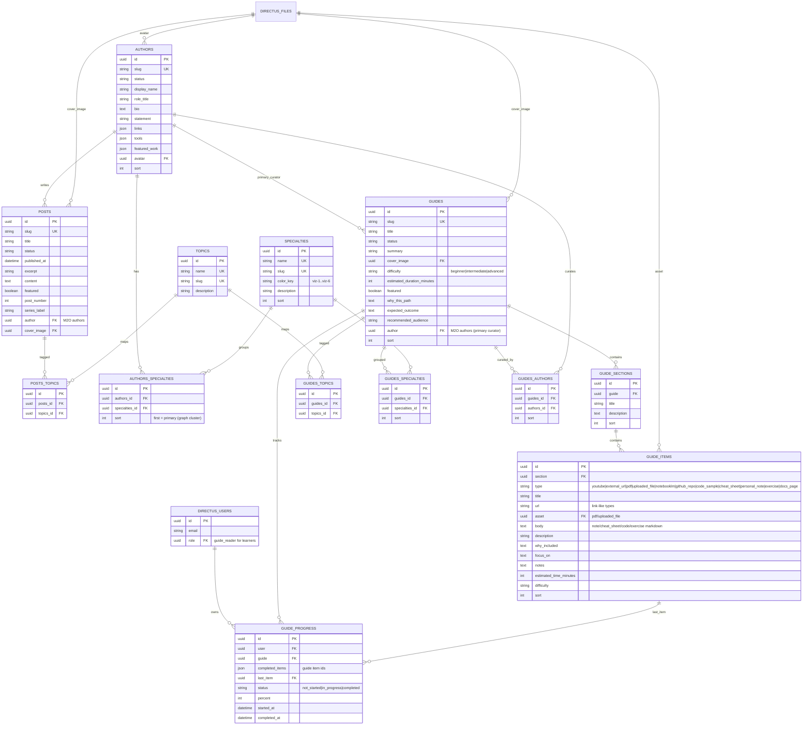

# Directus ERD — v4

Source of truth for fields: `08-DIRECTUS-CONTENT-MODEL.md`. v4.0 entities solid;
v4.1 (Field Guides) included below the divider comment. Field Guide previews are
public; full guide reading and progress use Directus users with the low-permission
`guide_reader` role (`09` §10).

