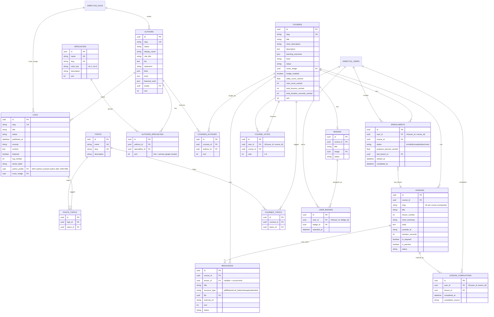

# Directus ERD — v4

Source of truth for fields: `08-DIRECTUS-CONTENT-MODEL.md`. v4.0 entities solid;
v4.1 (courses) included below the divider comment.

```mermaid
erDiagram
    %% ───── v4.0 ─────
    LOGS ||--o{ POSTS_TOPICS : tagged
    TOPICS ||--o{ POSTS_TOPICS : maps
    AUTHORS ||--o{ LOGS : writes
    AUTHORS ||--o{ AUTHORS_SPECIALTIES : has
    SPECIALTIES ||--o{ AUTHORS_SPECIALTIES : groups
    DIRECTUS_FILES ||--o{ LOGS : cover_image
    DIRECTUS_FILES ||--o{ AUTHORS : avatar

    LOGS {
      uuid id PK
      string slug UK
      string title
      string status
      datetime published_at
      string excerpt
      text content
      boolean featured
      int log_number
      string series_label
      uuid author_profile FK "M2O authors (named author after CMS-006)"
      uuid cover_image FK
    }
    AUTHORS {
      uuid id PK
      string slug UK
      string status
      string display_name
      string role_title
      text bio
      string statement
      json links
      json tools
      json featured_work
      uuid avatar FK
      int sort
    }
    SPECIALTIES {
      uuid id PK
      string name UK
      string slug UK
      string color_key "viz-1..viz-6"
      string description
      int sort
    }
    TOPICS {
      uuid id PK
      string name UK
      string slug UK
      string description
    }
    AUTHORS_SPECIALTIES {
      uuid id PK
      uuid authors_id FK
      uuid specialties_id FK
      int sort "first = primary (graph cluster)"
    }
    POSTS_TOPICS {
      uuid id PK
      uuid logs_id FK
      uuid topics_id FK
    }

    %% ───── v4.1 courses ─────
    COURSES ||--o{ LESSONS : has
    COURSES ||--o{ RESOURCES : has
    LESSONS ||--o{ RESOURCES : may_have
    COURSES ||--o{ COURSES_TOPICS : tagged
    TOPICS ||--o{ COURSES_TOPICS : maps
    COURSES ||--o{ COURSES_AUTHORS : taught_by
    AUTHORS ||--o{ COURSES_AUTHORS : instructs
    COURSES ||--o{ ENROLLMENTS : has
    DIRECTUS_USERS ||--o{ ENROLLMENTS : creates
    DIRECTUS_USERS ||--o{ LESSON_COMPLETIONS : completes
    LESSONS ||--o{ LESSON_COMPLETIONS : tracked_by
    COURSES ||--o{ COURSE_VOTES : receives
    DIRECTUS_USERS ||--o{ COURSE_VOTES : submits
    COURSES ||--o| BADGES : has
    BADGES ||--o{ USER_BADGES : assigned_as
    DIRECTUS_USERS ||--o{ USER_BADGES : earns
    ENROLLMENTS }o--|| LESSONS : last_lesson

    COURSES {
      uuid id PK
      string slug UK
      string title
      string short_description
      text description
      json learning_outcomes
      string level
      string status
      uuid cover_image FK
      boolean badge_enabled
      float utility_score_cached
      int vote_count_cached
      int total_lessons_cached
      int total_duration_seconds_cached
      int sort
    }
    LESSONS {
      uuid id PK
      uuid course_id FK
      string slug "UK per course (composite)"
      string title
      int lesson_number
      string short_summary
      text body
      string youtube_id
      int duration_seconds
      boolean is_required
      boolean is_preview
      string status
    }
    RESOURCES {
      uuid id PK
      uuid course_id FK
      uuid lesson_id FK "nullable = course-level"
      string title
      string resource_type "pdf|file|external_link|mindmap|notebooklm"
      uuid file FK
      string external_url
      int sort
      string status
    }
    ENROLLMENTS {
      uuid id PK
      uuid user_id FK "UK(user_id, course_id)"
      uuid course_id FK
      string status "enrolled|completed|archived"
      float progress_percent_cached
      uuid last_lesson_id FK
      datetime started_at
      datetime completed_at
    }
    LESSON_COMPLETIONS {
      uuid id PK
      uuid user_id FK "UK(user_id, lesson_id)"
      uuid lesson_id FK
      datetime completed_at
      string completion_source
    }
    COURSE_VOTES {
      uuid id PK
      uuid user_id FK "UK(user_id, course_id)"
      uuid course_id FK
      int vote "1-5"
    }
    BADGES {
      uuid id PK
      uuid course_id FK
      string title
      uuid image FK
      string status
    }
    USER_BADGES {
      uuid id PK
      uuid user_id FK "UK(user_id, badge_id)"
      uuid badge_id FK
      datetime awarded_at
    }
    COURSES_TOPICS {
      uuid id PK
      uuid courses_id FK
      uuid topics_id FK
    }
    COURSES_AUTHORS {
      uuid id PK
      uuid courses_id FK
      uuid authors_id FK
      int sort
    }
```
